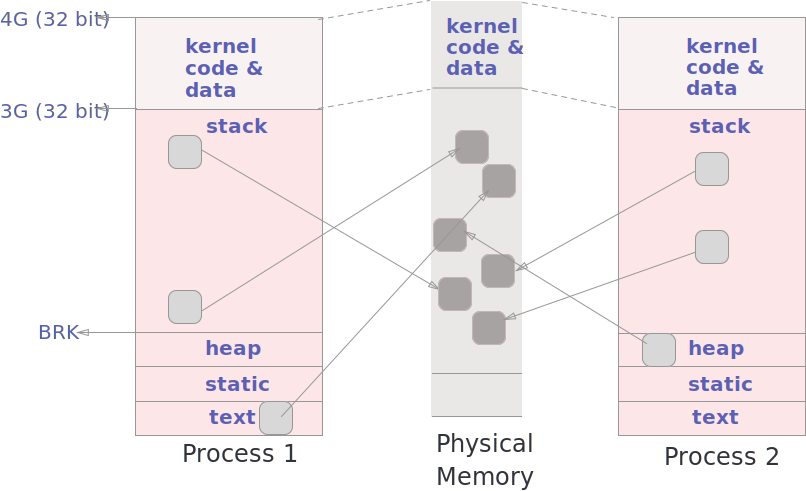

Feb 21 2019

Recall the bank example:

```c
pthread_mutex_lock(&lock);
balance++;
pthread_mutex_unlock(&lock);
```

### Two types of locks:
1. Sleeping Locks

2. Spin Locks


## Implementing spin lock

1. Wrong implmentation:

```c
int flag = 0;

lock() {
    while (flag == 1)
	;

    // This gap between testing and setting creates a race condition!

    flag = 1;
}

unlock() {
    flag = 0;
}
```


2. Correct implementation using atomic test_and_set hardware instruction:

```c
int flag = 0;

lock() {
    while(test_and_set(&flag))
	;
}

unlock() {
    flag = 0;
}
```
	
    The atomic test_and_set hardware instruction essentially does the following:
    
```c
	int test_and_set(int *lock) {
	    int old = *lock;
	    *lock = 1;
	    return old;
	}
 ```   

# Kernel


* Kernel code is shared by all processes. 
* Virtual memory is divided into pages. Each page size is 4K. 
* **Frame** is the **page** from the physical memory perspective (What you want to store is a page and where you want to store is a frame).

# Kernel Memory Region
* 8k size of per-process kernel stack - used while in kernel
* Recursion in kernel code is not preferred. 
* task_struct is about 1-2k. Since it's so big, it's never in the stack but allocated in the heap. Both threads and processes are represented as task_struct. 

```c
struct task_struct {
	struct list-head *rcu_node_entry;
}
```


* NOTE: task_struct doesn't have the **list_head**. Instead, init_task of pid 0, a swapper acts like a head. 

* **current**, which is a macro, provides a pointer to the task struct. 
* When context switch or system mode changes, task_struct needs to be immediately available. Where should the pointer to task_struct be saved?

* The stack pointer gets automatically set to point to the kernel stack by hardware. 

* To get to the bottom of the kernel stack, the following assembly code is used:

```c
movl $-8192 %eax
andl %esp %eax
```


* No matter where the current stack pointer is, it can always go to the bottom of the stack by killing 13 0's at the end of the address, since the stack size is 8k == 2^13.

# Runs Queues


* The highest priority task will run from a run queue (depending on a scheduler)
* Being on run queues doesn't necessarily mean it will run

# Wait Queues
* NOTE: we can't have a run queue structure for wait queues because we would end up having way too many list_head structs in task_struct, so we need a different structure for wait queues.
```c
struct waitqueue_head {
	spin_lock_t lock;
	list_head task_list;
}

struct waitqueue {
	task_struct *task;
	wq_func func; // call back function
	list_head task_list;
}
```


* wait queue head is the starting point for wait queues. And each wait_queue points to a task_struct.
* There are different kinds of wait queues such as lock wait queues, I/O wait queues, so if a process is waiting on I/O, it'd be put on the I/O wait queue. 

# TASK_RUNNING


* TASK_RUNNING - misnomer. It means a task is runnable. 
* schedule(): entry point to the scheduling function in the kernel.
* e.g. Timer interrupt fires and the timer interrupt updates the kernel process time. Then the handler calls schedule(), which calls pick_next_task(). After that context_switch() gets called, a new process gets to run
* Kernel keeps calling schedule() all the time. 

```c
void wait_event(wq, cond) {
	DEF_WAIT(wait);
    // forever loop here, because the process needs to be in the wait mode until the cond is true. It breaks out of the forever loop and stops waiting when the condition becomes true and finish_wait().
	for (;;) {
		prepare_to_wait(&wq, &wait, T_I);
		if (cond) {
			break;
		}
		if (signal_pending(current)) {
			break;
		}
		schedule();
	}
	finish_wait(&wq, &wait);
}

// another way of implementing wait_event 
do {
	DEFINE_WAIT(__wait);
	for (;;) {
		prepare_to_wait(&wq, &__wait, T_I);
		if (cond) {
			break;
		}
		if (!signal_pending(current)) {
			schedule();
			continue;	
		}
		ret = -ERESTARTSYS;
		break;
	}
	finish_wait(&wq, &wait);
} while (0)
```

```c
void prepare_to_wait(wait_queue_head_t *q, wait_queue_t *wait, int state) {
	unsigned long flags;

	wait->flags &= ~WQ_FLAG_EXCLUSIVE;
	spin_lock_irqsave(&q->lock, flags);
	if (list_empty(&wait->task_list))
		__add_wait_queue(q, wait);
	set_current_state(state);
	spin_unlock_irqrestore(&q->lock, flags);
}
```

<code>prepare_to_wait()</code> changes the process state to either T_I or T_U. It also adds the task back to the wait queue if necessary. 

Since <code>prepare_to_wait()</code> already locks that's attached to the queue_head, it's unnecessary to have a custom lock before using this function.

```c
typedef struct __wait_queue wait_queue_t;

struct __wait_queue {
	unsigned int flags;
#define WQ_FLAG_EXCLUSIVE	0x01
	void *private;
	wait_queue_func_t func;
	struct list_head task_list;
};
```

wait queue's descriptor address is stored in the private field.
