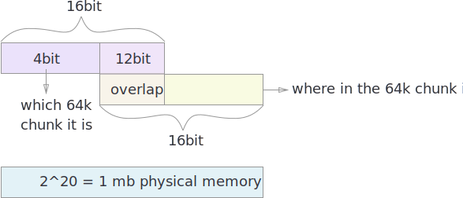
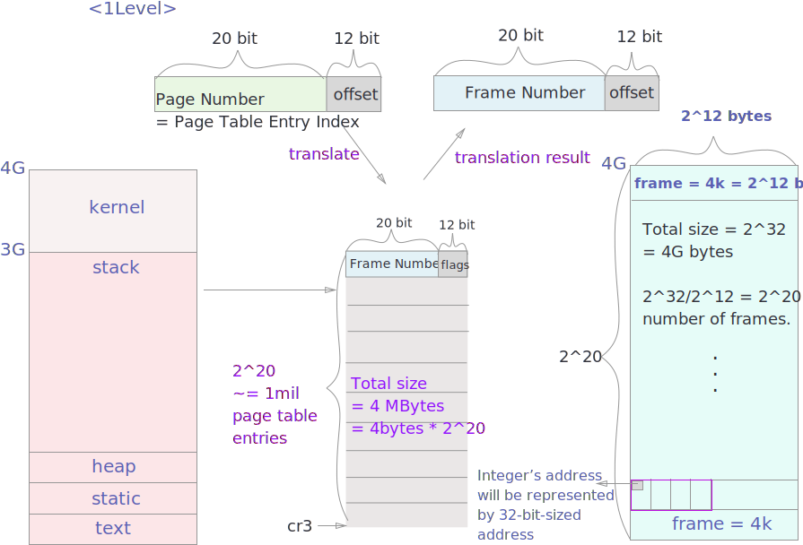
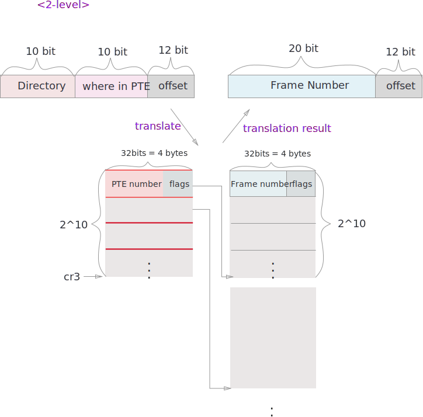
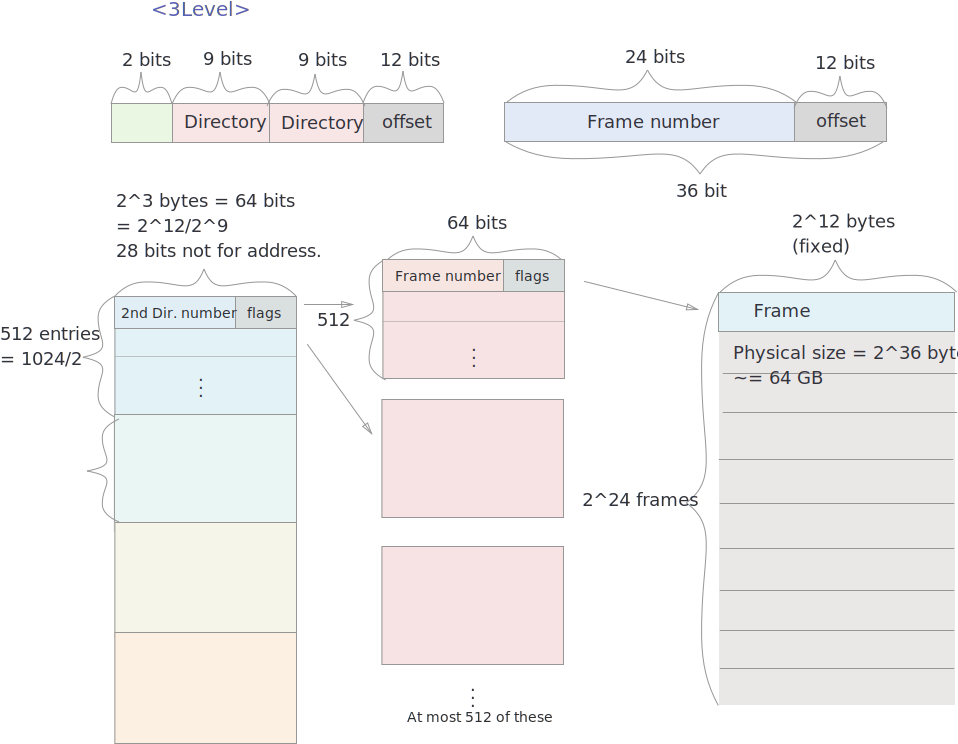
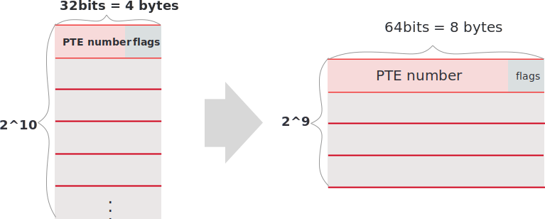
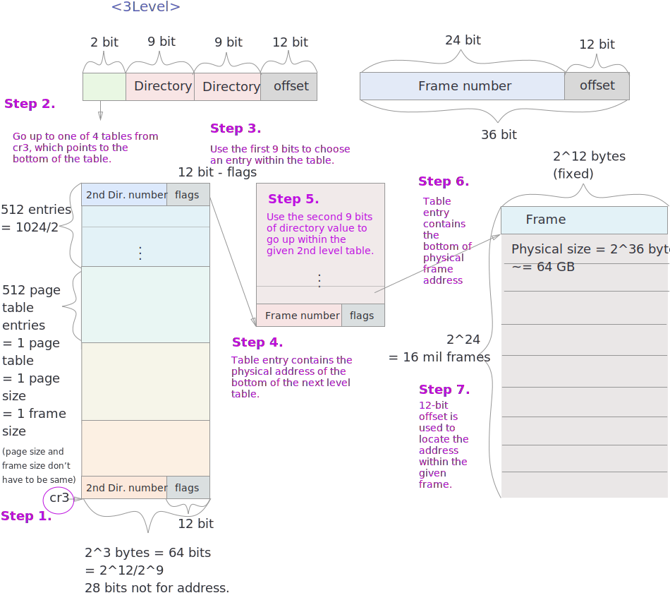
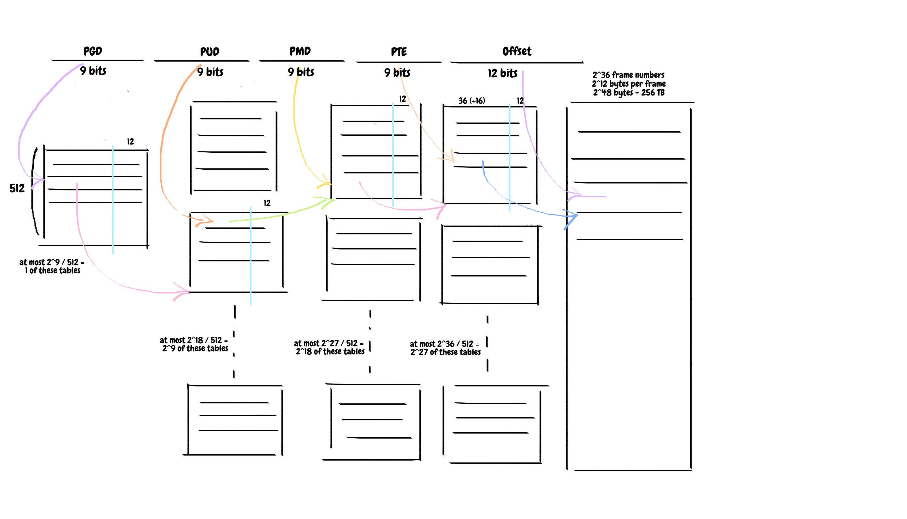

# 16-bit

* When the first processor came out, it was 16 bit-cpu. Each word, register and everything was 16 bits = 2 bytes.
* With 16 bits = you can address 2^16 ~= 64k addresses. Extremely small. Back then, full capacity of motherboard is 1mega bytes = 2^20 = 1,000k. 4 bit short to address all the memory. So they divided 1 mb memory into 64k chunks.
* NOTE: the physical memory doesn't have to be 2^16. It's just the maximum possible assuming nothing extra was done in the meory. So the physical memory can exceed 2^16 or can be less than that. 

* In order to address 2^20 address, two 16 bits were used and the 12 bits were overlapped. 
* 16-bit segment registers were used to denote the starting point of where your code is. -> So the code can't be more than 2^16 = 64k. 

# 1-LEVEL
## x86-32bit

* Segment registers are no longer needed in 32-bit, so in Linux they are all set to 0 (they are still 16-bit). Overlapping segment for the entire memory.  
* offset became a real physical address in 32 bit. 
* selector = segment register which remained 16 bit.
* base = starting address of the segment = constant value of 0
* limit = how big it is = constant value of 4g
* perm = whether it is code region. 
* PROBLEM: the page table is way too big.
* SOLUTION: 2-level paging  

# 2-LEVEL
## x86-32bit

* Directory is already created, but the second level bundle is created on demand. 
* Page Table Base Register (PTBR) points to the base of page table. In x86, it's called **cr3**.
* PTBR (cr3) contains the physical address of the bottom of the page table. Or else, the page table location won't be found. NOTE: Everything is physical including the page table
* OS stores PTBR in task struct (PCB), since every process has their own page table. 

# 3-LEVEL
## Physical Address Extension (PAE)

* 36 bit physical address
* Increased the number of pins from CPU to memory: 36 bits total 
* Internally everything is 32 bits. - virtual address limited to 4k
* But 4 more pins out of CPU, which means 2^32   *   2^4 = 64GB - physical memory - can support physical ram up to 64GBG
* Virtual memory limited but it allows you to learn a lot more processes. 
* 12 bit offset is the same since the page size is the same.

* 24 bit doesn't fit into 32 bit anymore. so each PTE now has to be 64 bits. 

# 4-LEVEL
## x86-64bit

* PGD = page global directory
* PUD = page uppder directory
* PMD = page middle directory
* PTE = pate table entry

