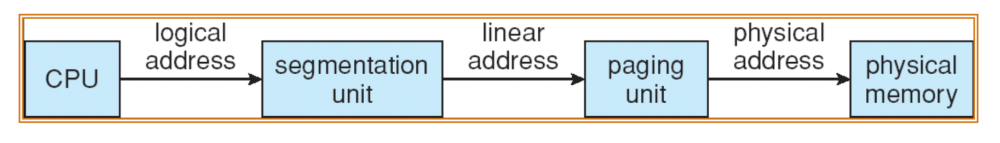

### Basics
* If the frame is 4(2^2) bytes, you need 2 bits offset to represent which of the four boxes it belongs to, because offset is the bit to represent where in the frame is the address. With 2 bits, you have 4 possibilities total, which can indicate all the bytes inside the 4 bytes box. 
* 2^x bytes can be represented by x number of bits to indicate the offset within the chunk.# Memory requirements

* Multule processes coexit in main memory but processes are not aware that memory is shared. 
* NOTE: 3 bits have 2^3 different ways of indicating numbers. 8 different cases can be represented with 3 bits.

* virtual memory translation to hardware memory address is done by the hardware MMU.
* The MMU table for translation is set up by operating systems when you start a new process. 
* Looking up addresses etc. is done by the hardware: CPU

# MMU

* It's divided into two different units: Segmentation unit and paging unit. 
* Unix and most modern os don't use segmentation unit. 
* In UNIX and most modern os, logical address and linear address are the same thing. 

* When the first processor came out, it was 16 bit-cpu. Each word, register and everything was 16 bits = 2 bytes.
* With 16 bits = you can address 2^16 ~= 64k addresses. Extremely small to fit the number of transistors and all that. Back then, full capacity of motherboard is 1mega bytes = 2^20 = 1,000k. 4 bit short to address all the memory. So they divided 1 mb memory into 64k chunks.
* NOTE: the physical memory doesn't have to be 2^16. It's just the maximum possible assuming nothing extra was done in the meory. So the physical memory can exceed 2^16 or can be less than that. 

* In order to address 2^20 address, two 16 bits were used and the 12 bits were overlapped. 
* 16-bit segment registers were used to denote the starting point of where your code is. -> So the code can't be more than 2^16 = 64k. 

# 32 bit

* Segment registers are no longer needed in 32-bit, so in Linux they are all set to 0 (they are still 16-bit). Overlapping segment for the entire memory.  
* offset became a real physical address in 32 bit. 

# Page translation
* Address bits = virtual page number (which of the page it is) + page offset (within the 4k page, where you are)
* Since offset stays the same, only virtual page number needs to be translated. 
* Page table maps vpn to physical page number. 
* MENTAL MODEL: physical address = page_table[virtual address/page size] + virtual address % page size

* PROBLEM: the page table is way too big. 

* NOTE: in one-level page table, 4MB, which is the size of the table and is per process, is used only for paging in the physical memory and not availalbe for storage.

# Page Translation Formula
* m-bit virtual address, n-bit physical address, k-bit page size
* frame size = 2^k
* number of virtual pages: 2^(m-k) = total virtual address availability / chunk size
* number of physical pages: 2^(n-k) = total physical address availability / chunk size
* number of entries in page table: 2^(m-k) = 
* vpn = va/(2^k)
* offset = va % (2^k)
* ppn = frame number = page_table[vpn]
* pa = ppn * (2^k) + offset

# MIDTERM EXERCISE

* 8-bit virtual address, 10 bit physical address, each page is 64 bytes = (2^6). 
1. How many virtual pages?
* (2^8)/64 = 4 virtual pages.
2. How many physical pages?
* (2^10)/64 = 16 physical pages. 
3. How many entires in page table?
* 4 entries, since there are 4 virtual pages. 
4. Given page table = [2,5,1,8], what's the physical address for virtual address 241?
* NOTE: The smallest address is 0, and the maximum address is 2^8 - 1, which is 255.
- 241/64 = 3 (dividing it by 64 because each box has 64 number of entries)
- 241%64 = 49
- page_table[3] = 8
- physical address = 8 * 64 + 49 = 561

# Page Protection
* In page table, 12 bit offset area saves protection bits
* PRESENT BIT: whether that virtual bit is currently being mapped to physical page e.g. PTE_P (present)
* READ/WRITE/EXECUTE BITS: can read/write/execute? e.g. PTE_W (writable)
* USER BIT: can access in user mode? e.g. PTE_U (user mode)

* NOTE: if "present" bit is not on, the process might have been swapped out. It used to exist, but it's not there anymore. So OS would try to look for it somewhere else like a disk. Swap files are not used these days. If more frames are needed, an existing frame would be saved in a swap file, which is created by OS somewhere in a disk, and that frame becomes now available for other processes to use. When the process runs again, the OS sees that the present bit is 0 and it would look somewhere else for data. 
* NOTE: When a program runs or you load a dynamic library, it maps address space into a file using <code>mmap()</code>. It sets up a content frame, but leaves the prsent bit 0. When the program tries to read that part of the memory, which doesn't exist yet, there would be a page fault. Then the page fault handler kicks in to do the actual job.

### example:

* 101: user code
* 110: kernel data
* 000: it used to exist but not available - page fault
* 111: user data

# x86-32bit

* Directory is already created, but the second level bundle is created on demand. 
* Page Table Base Register (PTBR) points to teh base of page table. In x86, it's called **cr3**.
* PTBR (cr3) contains the physical address of the bottom of the page table. Or else, the page table location won't be found. NOTE: Everything is physical here including the page table
* OS stores PTBR in task struct (PCB), since every process has their own page table. 

# Physical Address Extension (PAE)

* **36 bit physical address** BUT **32-bit virtual address**
* Increased the number of pins from CPU to memory: 36 bits total 
* NOTE: 6 bits are used to represent page, and 2 bits are used as offset in this case. 
* Internally everything is 32 bits. - virtual address limited to 4k
* but 4 more pins out of CPU - 2^32   *   2^4 = 64GB - physical memory - can support physical ram up to 64GBG
* Virtual memory limited but it allows you to learn a lot more processes. 
* 12 bit offset is the same since the page size is the same. (if the page size was different what would it change?)
* 24 bit doesn't fit into 32 bit anymore. so each PTE now has to be 64 bits. But within 64 bits, only 36 bits are used, so 28 bits are unused in page tables. 

# x86-64bit

* PGD = page global directory
* PUD = page uppder directory
* PMD = page middle directory
* PTE = pate table entry

# TLB

* Even in one level paging, at least two memory accesses need to be done one for the page table and the other for the frame to get what you want, which takes awhile.
* Embedded in CPU
* It gets flushed during context switch, because "load cr3" flushes TLB, and that's why context switch is expensive because the TLB needs to be rebuilt. 
* In order to resolve this problem, process IDs are attached to TLB entries, but context switch still needs to flush the TLB. so the intention wasn't to flush out, but to save the cache for each process id, but eventually the whole thing can get taken up by the new process so there is no point of doing that in the first place  
* EAT (Effective Access Time) = 2 + Lookup Time - Hit Ratio

# Page Sharing
 

* For shared librarires such as libc or mmap() share memory between processes that use it, so those processes map to the same reigon in the memory. 
* When it comes to <code>fork()</code>, both parent child share memory in the beginning, and the protection bits are set to be read-only. If either process tries to modify any value, there would be a page fault because it's illegal to try to write in the read-only region of the memory. But read-only is only temporary since the <code>page-fault-handler</code> kicks in and copies the value on demand so that they can modify values separately. (a.k.a. **COPY_ON_WRITE**)
* When "execl" gets called, mmap() is done to point to the ./a.out's beginning fo the file and make it so that frame has been swapped out. 

## Swapping
* If a page got swapped out, the frame number can now be used to locate where it is located in the disk with the 0 present bit. Because page table is per process, in the process where the pages got swapped out, it will have the present bit 0 and disk location is saved in the PTE entry instead of saving physical frame number. And another process, if it's using swapped out memoiry, it can freely refer to it, because page table is per process.
* Even in the same process they can still refer to swapped out frame numbers, beacuse swap file location in the disk is saved in hte PTE. 
 
## Page fault

* If a page is not backed by a physical frame, there would be a page fault, which generates an exception and the page fault handler gets executed.
* **Replacement** If there is no free frame, it needs to kick out one of the frames and saves it in a swap file.  
* **Page selection** When to bring pages from disk to memory
* **Demand paging** load page on page fault, so os starts up process with no pages loaded and waits until a page absolutely must be in memory. 
* Reuqest paging: user specifies which pages are needed. 
* Prepaing: load page before it is referenced. 

## Thrashing
* Page fault to get page -> but there is no free frame -> Existing frame is replaced -> But quickly need replaced frame back == System is busy swapping pages and it has no time to do anything else. 
* (NOTE: paging is tightly integrated into disk I/O.)

## Page replacement algorithms:
* Optimal: throw out page that won't be used for longest time in future.
* Random: throw out a random page. 
* FIFO: throw out page that was loaded in first. 
* LRU (lru: least recently used): throw out page that hasn't been used in longest time. 

## Belady's anomaly
* If you reduce the number of frames, the number of page faults decreases. 

## Implementing LRU:
* A doubly linked list of pages
* Every time page is referenced, move it to the front of the list. 
* Page replacement: remove the page from back of list. 

## Clock Algorithm
* If there is no free frame, this algorithm would kick in. 
* Linked list of pages
* if the first bit is 1, set it to 0 and move onto the next bit. 
* Reference bit: if the page was cleared or not. (hardware - frame) 
* The first 0 bit (reference bit) that's seen gets kicked out.
* Dirty bit: the memory needs to be written to a file at some point. (hardware - frame) 
* The modified version looks at both reference bit and dirty bit. 
* ref = 0, dirty = 0 -> victim page
* ref = 0, dirty = 1 -> skip
* ref = 1, dirty = 0 -> ref = 0, dirty = 0 -> skip
* ref = 1, dirty = 1 -> ref = 0, dirty = 1 -> skip
* If all the dirty bits are set to 1 after looping around all of them, run swap daemon (background process) to flush unreferenced dirty pages to the disk (just find the one that needs disk write and do the job) and repeat.  
* Use dirty
