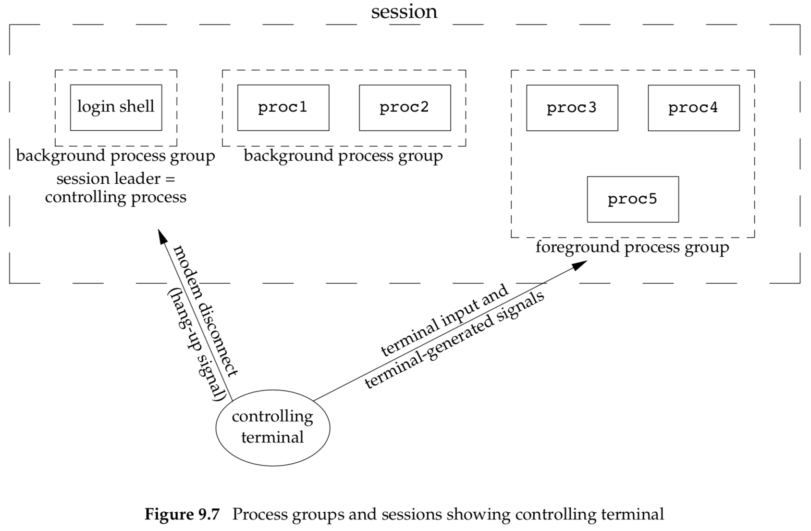

Tue 2/6/2018
# Signals

## Process groups, sessions, controlling terminal

NOTE: <code>&</code> puts the process in the background.
```c
proc1 | proc2 & 
proc3 | proc4 | proc5
```



### Daemon process - when a process gets detached from the terminal, it becomes a background process, a.k.a. daemon process.

It's not the best way to describe, but a good rule of thumb is

### Session - Shell window

### Session leader - the bash shell in a shell window

### Group - each pipe line

### Group leader - the first one in the group

When you close the window, the session leader will get the hang-up signal and it will act accordingly.

Regular terminal input goes to the foreground process group. 

No need to know the nitty gritty of the sessions, groups, etc. Just need to know things related to <code>signal()</code>

## Sending Signals

```c
#include <signal.h>

// to send signals to a process
int kill(pid_t pid, int signo); 

// to send signals to yourself
int raise(int signo);

// Both return: 0 if OK, -1 on error
```


if pid < 0, the signal is sent to the process group with pgid == |pid|

e.g. -10 = all the processes with a group id of 10

## SIGALRM

### alarm() and pause() functions

The alarm function allows us to set a timer that will expire at a specified time in the future. When the timer expires, the SIGALRM signal is generated. If we ignore or don’t catch this signal, its default action is to terminate the process.

```c
#include <unistd.h>

// set an alarm
unsigned int alarm(unsigned int seconds);

// to pause
int pause(); // -1 with errno set to EINTR

```

### Waking up slow system calls using alarm()

```c
static void sig_alrm(int signo) {
	// do nothing
}

int main() {
	int n;
	char line[MAXLINE];

	if (signal(SIGALRM, sig_alrm) == SIG_ERR) perror("signal error");

	// set a timer of 10 seconds. If read() is hanging for 10 seconds, read() will return an error: EINTER
	alarm(10);

	// read returns with an error since it's a slow system call and there was a signal after 10 seconds
	if ((n = read(STDIN_FILENO, line, MAXLINE)) < 0) perror("read error");

	// alarm(0) cancels the alarm
	alarm(0);

	write(STDOUT_FILENO, line, n);
}
```
### There are two problems:

1. It's possible that the system is so slow that after alarm(10) was set, it could take 10 seconds to get to the next line of code, which is <code>read()</code>. Then the alarm will miss and <code>read()</code> can hang forever. 

2. This doesn't work if slow system calls are automatically restarted. If system calls are interrupted by system, slo calls on free bsd systems will restart it, but linux's systme calls get set to default. 

### Using setjmp and longjmp to solve the two problems (Optional material)

setjmp and longjmp are like GOTOs, except that they can only jump to the previous code. 

setjmp - setting the place to jump to

longjmp - jumping to where setjmp was called.

```c
#include "apue.h"
#include <setjmp.h>

static void sig_alrm(int signo) {
	longjmp(env_alrm, 1);
}

static jmp_buf env_alrm;

int main() {
	int n;
	char line[MAXLINE];

	if (signal(SIGALRM, sig_alrm) == SIG_ERR) perror("signal error");

	// make note of where you are in the call stack: your register variables and local variables etc. 
	// it's a library function and doesn't have to do with context switch.
	// question? does the alarm start again, when it comes back to setjmp? Loop?
	if (setjmp(env_alrm) != 0) perror("read timeout");

	alarm(10);

	if ((n = read(STDIN_FILENO, line, MAXLINE)) < 0) perror("read error");

	alarm(0);

	write(STDOUT_FILENO, line, n);
}
```

## Signal Sets

sig_t is an integer where its bits represent a signal - on 8 byte integer = 64 bit integer, each bit can indicate if the bit is the signal is set. 

```c
int sigemptyset(sigset_t *set); // fill the bit vector with 0s

int sigfillset(sigset_t *set);

int sigaddset(sigset_t *set, int signo);

int sigdelset(sigset_t *set, int signo);

int sigismember(const sigset_t *set, int signo);

// returns 1 if ture, 0 if false, -1 on error

```

```c
#define sigemptyset(ptr) (*(ptr) = 0) // setting the pointer to 0

#define sigfillset(ptr) (*(ptr) = ~(sigset_t)0, 0) // the comma operator makes the return value of the expression is 0. So it makes the ptr -1, and return 0, since it's supposed to return 0, if it's ok.

int sigaddset(sigset_t *set, int signo) {
	// error check
	if (SIGBAD(signo)) {
		errno = EINVAL;
		return -1;
	}

	//moving 1 to the place you want to turn the bit on. 
	*set |= 1 << (signo - 1);
	
	return 0;
}

int sigdelset(sigset_t *set, int signo) {
	if (SIGBAD(signo)) {
		errno = EINVAL;
		return -1;
	}

	// move to the designated place and turn the bit off with the & operator. 
	*set &= ~(1 << (signo - 1)); 
	return 0;
}

int sigismember(const sigset_t *set, int signo) {
	if (SIGBAD(signo)) {
		errno = EINVAL;
		return -1;
	}

	return ((*set & (1 << (signo - 1))) != 0);
}
```

### sigprocmask() & sigpending() functions

```c
// how - SIG_BLOCK, SIG_UNBLOCK, SIG_SETMASK - mix of block and unblock
int sigprocmask(int how, const sigset_t *restrict set, sigset_t *restrict oset);

int sigpending(sigset_t *set); // which signals are currently pending

// returns 0 if ok, -1 on error
```

```c
static void sig_quit(int signo) {
	printf("caught SIGQUIT\n");
	if (signal(SIGQUIT, SIG_DFL) == SIG_ERR) perror ("can't reset SIGQUIT");
}

int main() {
	// why does it have old mask and new mask?
	// oldmask is returned in case the user wants the original mask back. 
	sigset_t newmask, oldmask, pendmask

	if (signal(SIGQUIT, sig_quit) == SIG_ERR) perror("can't catch SIGQUIT");

	sigemptyset(&newmask);
	// ctrl + backslash acts like ctrl+c and sends a signal then creates a file named core. 
	// You can pass that file to the debugger and this is where the word "core dump" comes.

	sigaddset(&newmask, SIGQUIT); 

	// block the signal for my process
	// it receives the oldmask in case one might need it later.
	if (sigprocmask(SIG_BLOCK, &newmask, &oldmask) < 0) perror("sig block error)"

	// while it's sleeping, if you send SIGQUIT, the process will not quit.
	sleep(5);

	if (sigpending(&pendmask) < 0) perror("sigpending error");
	// after sleep() is over, it will show some SIGQUITs that are pending.
	if (sigismember(&pendmask, SIGQUIT)) printf("SIGQUIT pending");

	// setting the oldmask to sigprocmask to restore the signal mask
	if (sigprocmask(SIG_SETMASK, &oldmask, NULL) < 0) perror("SIG_SETMASK error");
	// IMPORTANT: even before the sigprocmask returns, 
	// the signal mask is already restored and a blocked signal was delivered. 
	// IMPORTANT: signals do not get queued. 
	// Therefore, it will pend only one signal and the subsequence of it will be lost. 
	
	printf("SIGQUIT unblocked");

	sleep(5);
	// after the process goes to sleep, now ctrl backslash gets caught again.
}
```

```c
int sigaction(int signo, const struct sigaction *restrict act, struct sigaction *restrict oact);

struct sigaction {
	void (*sa_handler)(int); // signal handler
	sigset_t sa_mask; // sigaction structure - siganls to block
	int sa_flags; // signal options
	// alternate handler (NOT IMPORTANT) - you can receive the status of the signal in this function
	void (*sa_sigaction)(int, siginfo_t *, void *);
}
```
NOTE: signal that you're handling is obviously always being blocked, which you indicate in the signal handler. <code>sa_mask</code> is to add additional signals to handle. 

### An implementation of <code>signal()</code> using sigaction
For homework, use this function for homework 3

```c
Sigfunc *signal(int signo, SigFunc *func) {
	struct sigaction act, oact;
	act.sa_handler = func;
	sigemptyset(&act.sa_mask);

	act.sa_flags = 0;
	if (signo == SIGALRM) {
#ifdef SA_INTERRUPT
		act.sa_flags |= SA_INTERRUPT;		
#endif 
	} else {
		// only if it's an alarm, you restart the slow system call.
		act.sa_flags |= SA_RESTART; 
		//SA_RESTART makes a slow system call not return an error but restart like FreeBSD system
	}

	if(sigaction(signo, &act, &oact) < 0)
		return (SIG_ERR);
	return(oact.sa_handler);
}
```
* Signal handler doesn't get reset. 
* Interrupted system calls automatically restart, ecept for SIGALRM


### Signal to not SA_RESTART
```c
Sigfunc * signal_intr(int signo, Sigfunc *func) {
	struct sigaction act, oact;
	act.sa_handler = func;
	sigemptyset(&act.sa_mask);
	act.sa_flags = 0;
#ifdef SA_INTERRUPT
	act.sa_flags |= SA_INTERRUPT;
#endif
	if (sigaction(signo, &act, &oact) < 0) 
		return (SIG_ERR);
	return (oact.sa_handler);
}
```

## Difference between signal and sigaction

1. The signal() function does not (necessarily) block other signals from arriving while the current handler is executing; sigaction() can block other signals until the current handler returns.
2. The signal() function (usually) resets the signal action back to SIG_DFL (default) for almost all signals. This means that the signal() handler must reinstall itself as its first action. It also opens up a window of vulnerability between the time when the signal is detected and the handler is reinstalled during which if a second instance of the signal arrives, the default behaviour (usually terminate, sometimes with prejudice - aka core dump) occurs.
3. The exact behaviour of signal() varies between systems — and the standards permit those variations.
