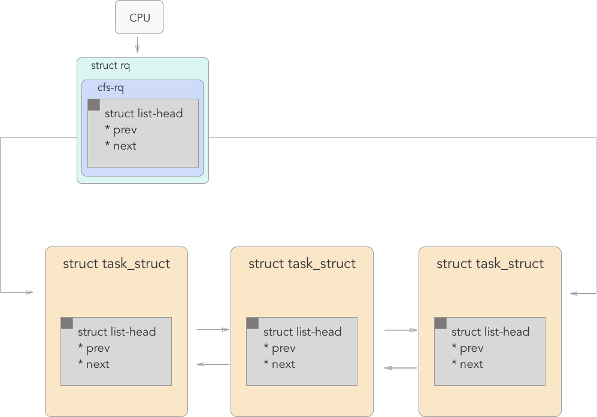

Case 1: current task is not in freezer, some task P get switched to freezer, does P preempt current task ?
Case 2: current task is in freezer, another task P get switched to freezer, does P preempt current task?
Case 3: current task get switched to freezer, does it run first than all other freezer tasks?
Case 4: What happens while a current task is running there is another process of a higher priority?
Case 5: What happens to the currently running task when there is another process of a lower priority?




prepare_to_wait()

```c
void
prepare_to_wait(wait_queue_head_t *q, wait_queue_t *wait, int state)
{
	unsigned long flags;

	wait->flags &= ~WQ_FLAG_EXCLUSIVE;
	spin_lock_irqsave(&q->lock, flags);
	if (list_empty(&wait->task_list))
		__add_wait_queue(q, wait);
	set_current_state(state);
	spin_unlock_irqrestore(&q->lock, flags);
}
EXPORT_SYMBOL(prepare_to_wait);
```

```c
static void __sched notrace __schedule(bool preempt)
{

	/** Omitted some code **/
	
	next = pick_next_task(rq, prev, cookie);
	clear_tsk_need_resched(prev);
	clear_preempt_need_resched();
	rq->clock_skip_update = 0;

	if (likely(prev != next)) {
		rq->nr_switches++;
		rq->curr = next;
		++*switch_count;

		trace_sched_switch(preempt, prev, next);
		rq = context_switch(rq, prev, next, cookie); /* unlocks the rq */
	} else {
		lockdep_unpin_lock(&rq->lock, cookie);
		raw_spin_unlock_irq(&rq->lock);
	}
}

```
<code>schedule()</code> calls pick_next_task to get the next available task. Then context_switch() inside the if statment gets called to suspend the running process and run the new task.

```c
/*
 * context_switch - switch to the new MM and the new thread's register state.
 */
static __always_inline struct rq *
context_switch(struct rq *rq, struct task_struct *prev,
	       struct task_struct *next, struct pin_cookie cookie)
{
	struct mm_struct *mm, *oldmm;

	prepare_task_switch(rq, prev, next);

	if (!mm) {
		next->active_mm = oldmm;
		atomic_inc(&oldmm->mm_count);
		enter_lazy_tlb(oldmm, next);
	} 	

	/* code omitted */

	/* Here we just switch the register state and the stack. */
	switch_to(prev, next, prev);
	barrier();

	return finish_task_switch(prev);
}
```
It changes the register values, stack variables, etc. of the currently running process and load it to the task struct of the next process to run. Inside <code>context_switch()</code> mm_struct's pointers are changed to a new task and <code>switched_to</code> function got called. <code>switch_to</code> switches to a new process to run so the by the time <code>context_switch()</code> returns, a new process starts running. It is an interesting function in that it gets called in one process but gets returned in another process.  

NOTE: trying to acquire spin_lock would put the task in run queue as a ready state.

<code>try_to_wake_up(struct task_struct *p, unsigned int state, int wake_flags)</code> wakes up a thread. Note that p is a process or thread to wake u, state is a task state, and wake)flags are make modifier flags. This function puts the thread on the run queue if it's not there after choosing the next available cpu by calling <code>select_task_rq()</code>.

```c
static int
try_to_wake_up(struct task_struct *p, unsigned int state, int wake_flags)
{
/* Code omitted */
	p->sched_contributes_to_load = !!task_contributes_to_load(p);
	p->state = TASK_WAKING;

	cpu = select_task_rq(p, p->wake_cpu, SD_BALANCE_WAKE, wake_flags);
	if (task_cpu(p) != cpu) {
		wake_flags |= WF_MIGRATED;
		set_task_cpu(p, cpu);
	}
#endif /* CONFIG_SMP */

	ttwu_queue(p, cpu, wake_flags);
stat:
	ttwu_stat(p, cpu, wake_flags);
out:
	raw_spin_unlock_irqrestore(&p->pi_lock, flags);

	return success;
}
```

```c
struct sched_class {
	const struct sched_class *next;

	void (*enqueue_task) (struct rq *rq, struct task_struct *p, int flags);
	void (*dequeue_task) (struct rq *rq, struct task_struct *p, int flags);
	void (*yield_task) (struct rq *rq);
	bool (*yield_to_task) (struct rq *rq, struct task_struct *p,
			       bool preempt);

	void (*check_preempt_curr) (struct rq *rq, struct task_struct *p,
				    int flags);

	/*
	 * It is the responsibility of the pick_next_task() method that will
	 * return the next task to call put_prev_task() on the @prev task or
	 * something equivalent.
	 *
	 * May return RETRY_TASK when it finds a higher prio class has runnable
	 * tasks.
	 */
	struct task_struct * (*pick_next_task) (struct rq *rq,
						struct task_struct *prev,
						struct pin_cookie cookie);
	void (*put_prev_task) (struct rq *rq, struct task_struct *p);

#ifdef CONFIG_SMP
	int  (*select_task_rq)(struct task_struct *p, int task_cpu, int sd_flag,
			       int flags);
	void (*migrate_task_rq)(struct task_struct *p);

	void (*task_woken) (struct rq *this_rq, struct task_struct *task);

	void (*set_cpus_allowed)(struct task_struct *p,
				 const struct cpumask *newmask);

	void (*rq_online)(struct rq *rq);
	void (*rq_offline)(struct rq *rq);
#endif

	void (*set_curr_task) (struct rq *rq);
	void (*task_tick) (struct rq *rq, struct task_struct *p, int queued);
	void (*task_fork) (struct task_struct *p);
	void (*task_dead) (struct task_struct *p);

        /*
	 * The switched_from() call is allowed to drop rq->lock, therefore we
	 * cannot assume the switched_from/switched_to pair is serliazed by
	 * rq->lock. They are however serialized by p->pi_lock.
	 */
	void (*switched_from) (struct rq *this_rq, struct task_struct *task);
	void (*switched_to) (struct rq *this_rq, struct task_struct *task);
	void (*prio_changed) (struct rq *this_rq, struct task_struct *task,
			      int oldprio);

	unsigned int (*get_rr_interval) (struct rq *rq,
					 struct task_struct *task);

	void (*update_curr) (struct rq *rq);

#define TASK_SET_GROUP  0
#define TASK_MOVE_GROUP 1

#ifdef CONFIG_FAIR_GROUP_SCHED
	void (*task_change_group) (struct task_struct *p, int type);
#endif
};
```

## select_task_rq
```c
int  (*select_task_rq)(struct task_struct *p, int task_cpu, int sd_flag, int flags);
// p = the task to run.
// task_cpu = the cpu the task is currently on
// sd_flag = multiprocesscor balancing flags. Choose from here: https://elixir.bootlin.com/linux/v4.0/source/include/linux/sched.h#L909
// flag = wake flags
```

This function is used to decide on which cpu a task will run when it wakes up from sleep. In fair scheduler, <code>select_task_rq_fair</code> selects target runqueue for the waking task in domains with sd_flags such as SD_BALANCE_WAKE, SD_BALANCE_FORK or SD_BALANCE_EXEC in order to do balance loading by choosing the CPU with the least amount of work. 

A process gets executed in the cpu where it's first forked, but when it gets migrated to another cpu, this function is called. For example, sleeping tasks can be migrated by another run queue by try_to_wake_up(), which calls select_task_rq().

NOTE: by the time this function gets called inside the core scheduler, the lock is already held.

## enqueue_task
```c
void (*enqueue_task) (struct rq *rq, struct task_struct *p, int flags);
// rq = the queue to put the task to
// p = the task to enqueue
// flags = the state flags when this function gets called e.g. https://elixir.bootlin.com/linux/v4.4.26/source/kernel/sched/sched.h#L1165
```

This function is called to add a task on the run queue. Instead of directly enqueing the task, an appropriate sched_entity that represents the task needs to be enqueued at the right type of the queue. 

## dequeue_task
```c
void (*dequeue_task) (struct rq *rq, struct task_struct *p, int flags);
// rq = the queue to delete the task from
// p = the task to remove
// flags = the state flags when this function gets called e.g. https://elixir.bootlin.com/linux/v4.4.26/source/kernel/sched/sched.h#L1165

```
This function is called to remove a task from the run queue. 

## 
## task_tick
```c 
void (*task_tick) (struct rq *rq, struct task_struct *p, int queued);
// rq = current cpu's run queue
// p = current task
// queued = flag to indicate if the task is queued.
```
<code>task_tick()</code> is to decide what to do with the current cpu's run queue and the task when there was a tick. This function decrements the tick for each process as well as deciding what to do when the time is up for each task. 

The kernel's timer calls this function through the core scheduler. Inside kernel/timer.c there is a function called <code>update_process_times(int user_tick)</code> which is called from the timer interrupt handler to charge one tick to the current process. 

```c 
void update_process_times(int user_tick) {
       ...
        scheduler_tick();
        run_posix_cpu_timers(p);
}
```

<code>scheduler_tick()</code> is in core.c and <code>task_tick()</code> gets called in there. 

```c 
void scheduler_tick(void)
{
	int cpu = smp_processor_id();
	struct rq *rq = cpu_rq(cpu);
	struct task_struct *curr = rq->curr;
	struct rq_flags rf;

	sched_clock_tick();

	rq_lock(rq, &rf);

	update_rq_clock(rq);
	curr->sched_class->task_tick(rq, curr, 0);
```


## update_curr
```c
void (*update_curr) (struct rq *rq);
// rq - currente cpu's run queue
```
CFS calls update_curr() if the previous task is still on the runque and makes the current task NULL. RT updates the current task's runtime statistics and lets the previous task eligible for pushing so that it can be done later. 
This function is called in multiple places including <code>sched_setscheduler()</code> and <code>set_user_nice()</code>.

## switched_to
```c
void (*switched_to) (struct rq *this_rq, struct task_struct *task)
// rq - current cpu's run queue
// task - current task
```

This function is used when the scheduler policty switches to that of interest. <code>this_rq</code> is the run queue where the current task belongs to. <code>task</code> is the currently running task. 

```c
static inline void check_class_changed(struct rq *rq, struct task_struct *p,
				       const struct sched_class *prev_class,
				       int oldprio)
{
	if (prev_class != p->sched_class) {
		if (prev_class->switched_from)
			prev_class->switched_from(rq, p);

		p->sched_class->switched_to(rq, p);
	} else if (oldprio != p->prio || dl_task(p))
		p->sched_class->prio_changed(rq, p, oldprio);
}
```

Both <code>switched_to</code> and <code>switched_from</code> is used in <code>check_class_changed</code>. If the previous task's schedule policy is different from the current task's schedule policy <code>swiched_from</code> and <code>swiched_to</code> get called. Note that <code>switched_from</code>'s function existence is checked before it gets called, but switched_to's null check is not performed.

Then, <code>check_class_changed</code> gets called inside sched_setscheduler (struct task_struct *p, const struct sched_attr *attr, bool user, bool pi), which is returned by <code>int sched_setscheduler(struct task_struct *p, int policy, const struct sched_param *param)</code> sched_setscheduler changes the scheduling policty and/or real time priority of a thread. 

It checks if the policy is valid, if schedule priority level matches the scheduler policty level, and if user has the permission to change the priorities If the task is queued for run queue, it will dequeue and if it's running, it would be 
sched_setscheduler()

If the task is already on the run queue, it is dequed by calling <code>p->sched_class->dequeue_task()</code> so that the task can be removed from the run queue and, with a new priority, it is enqueued again. 

If the task is currently running, <code>put_prev_task</code> is called and the task now becomes a previous task. 

Then <code>setscheduler</code> is called to change the priority of the current task. 

For the currently running task, set_curr_task() is called to set the previous task with a new priority gets set as the current task of a given CPU.

```c
static void __setscheduler(struct rq *rq, struct task_struct *p,
			   const struct sched_attr *attr, bool keep_boost)
{
	...
	
	if (dl_prio(p->prio))
		p->sched_class = &dl_sched_class;
	else if (rt_prio(p->prio))
		p->sched_class = &rt_sched_class;
	else
		p->sched_class = &fair_sched_class;
}
```

After that, <code>check_class_changed</code> gets called, which triggers <code>switched_to()</code> and <code>switched_from()</code>.

## put_prev_task

```c
void put_prev_task(struct rq *rq, struct task_struct *p);
// rq = is the current cpu where the p is running 
// p is the task to be taken off. 
```

It is called whenever the task is taken off the cpu. Note that this function or something equivalent needs to be called inside <code>pick_next_task()</code>. For more information please read <code>pick_next_task</code>. In round-robin scheduler, once a task's given time is up and the task has remaining work, put_prev_task() should be called to put the task at the end of the queue.

## pick_next_task
```c
struct task_struct *pick_next_task (struct rq *rq,
				    struct task_struct *prev,
				    struct pin_cookie cookie);

// rq - the run queue to choose the next task from
// prev - the task that is currently running
// cookie - cookie
```

This function is to decide which task should run next and returns the task that should be running now. <code>schedule()</code> will call <code>pick_next_task()</code>

Instead of returning the task that should run next, it should return the task that should run at this moment.

Note that it is pick_next_task's responsibility to call <code>put_prev_task</code> or something equivalent. Note that prior kernels called put_prev_task() before calling pick_next_task()

Note that when a specific class' <code>pick_next_task()</code> gets called it's not calling the previous task's pick_next_task() function. The for loop iterates over each class starting from the highest priority class. Then it calls each class' pick_next_task, which returns a pointer to its next runnable process or NULL, if there is nothing to run. The loop continues until there is a class that has tasks to run. 

```c
static inline struct task_struct *
pick_next_task(struct rq *rq, struct task_struct *prev, struct rq_flags *rf)
{
for_each_class(class) {
		p = class->pick_next_task(rq, prev, rf);
		if (p) {
			if (unlikely(p == RETRY_TASK))
				goto again;
			return p;
		}
	}
```
That's why when <code>put_prev_task</code> gets called inside each class' pick_next_task() (e.g. pick_next_task_rt), the generic put_prev_task needs to be called instead of put_prev_task_rt.

## set_curr_task
```c
void (*set_curr_task) (struct rq *rq)
```

This function is called when a task changes its scheduling class or task group.
